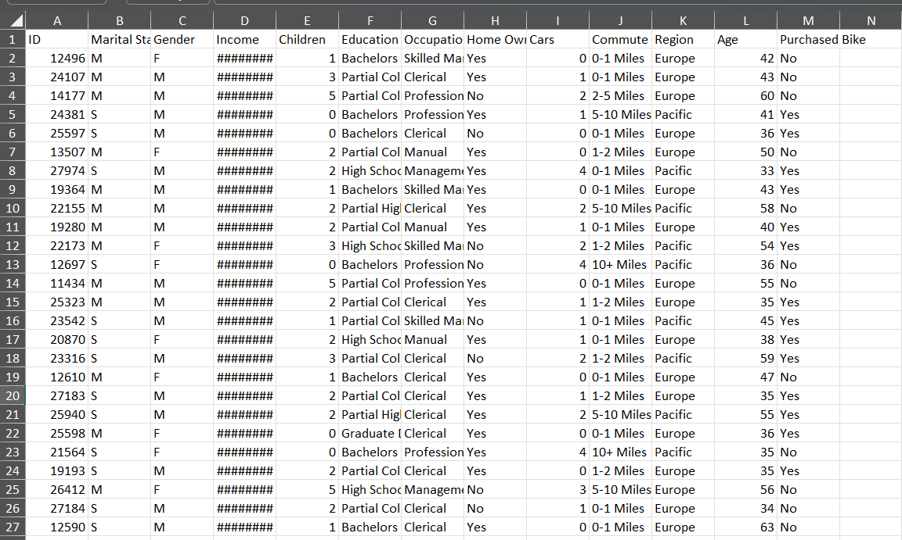
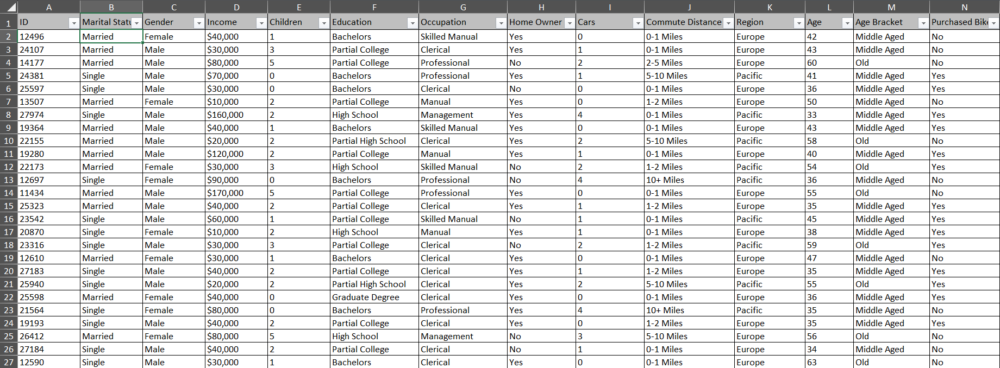
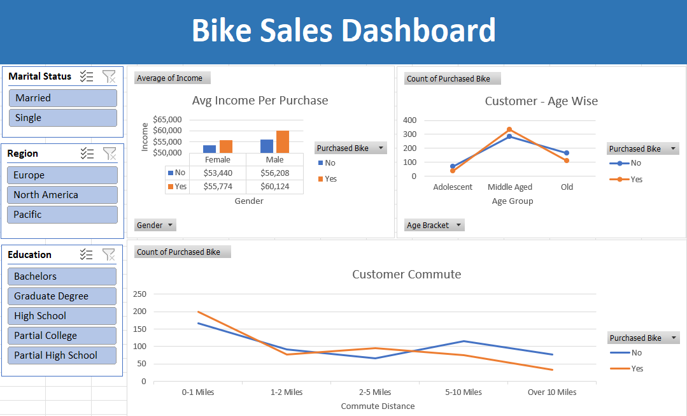

# Excel Data Cleaning & Bike Sales Dashboard

## Project Overview
This project demonstrates end-to-end data analysis using Microsoft Excel, starting from a messy raw dataset and ending with an interactive dashboard.

The goal was to clean, transform, and analyze customer data to identify patterns influencing bike purchases.

---

## Dataset Issues (Before Cleaning)
- Abbreviated categorical values (M, S, F)
- Inconsistent formatting
- Income displayed incorrectly (#######)
- No age grouping
- Unstructured column names

---

## Data Cleaning & Transformation
- Expanded marital status and gender values
- Corrected income formatting and data types
- Standardized education and occupation labels
- Created an **Age Bracket** column
- Renamed columns for clarity

---

## Analysis Performed
- Average income by gender and purchase decision
- Customer distribution across age brackets
- Commute distance vs bike purchase behavior
- Regional and educational filtering using slicers

Pivot tables were used to summarize and analyze the cleaned data.

---

## Dashboard
An interactive Excel dashboard was created using pivot charts and slicers to explore customer behavior.

---

## Tools Used
- Microsoft Excel
- Pivot Tables & Pivot Charts
- Slicers
- Data Cleaning Techniques

---

## Key Skills Demonstrated
- Data Cleaning & Preparation
- Exploratory Data Analysis (EDA)
- Business-focused visualization
- Dashboard design in Excel
